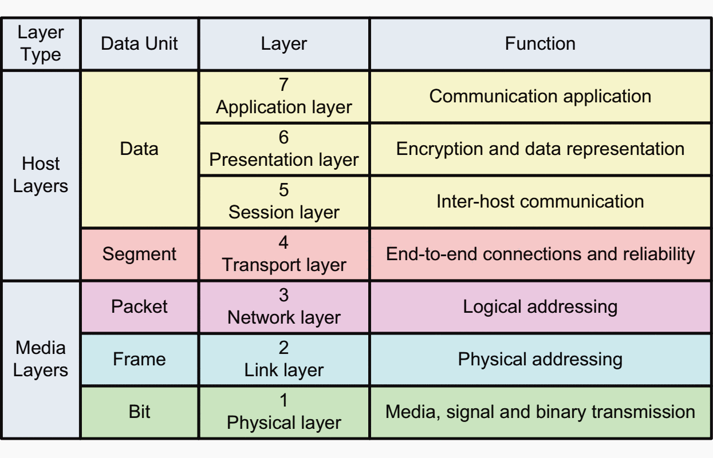
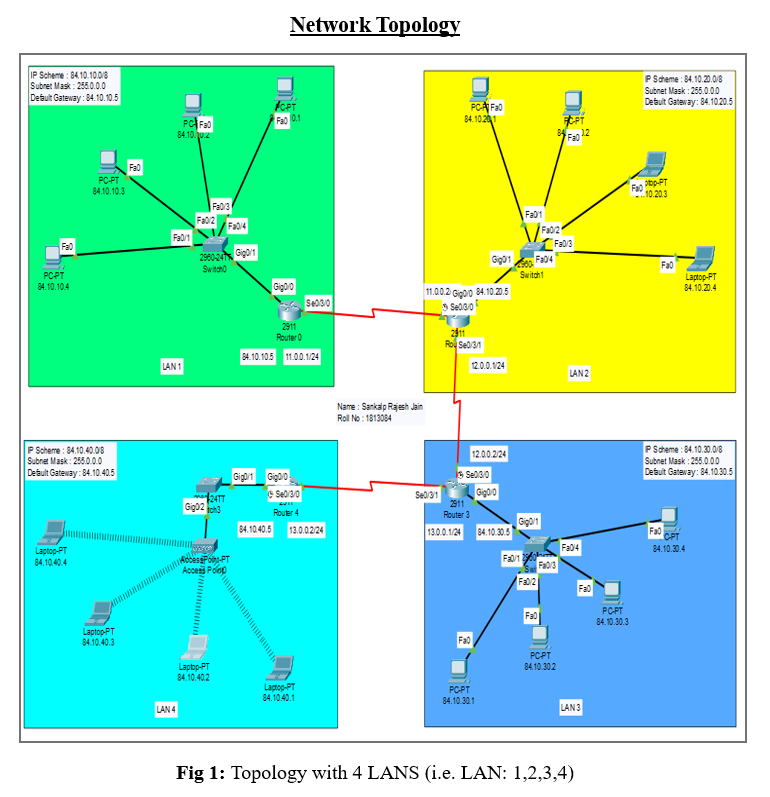
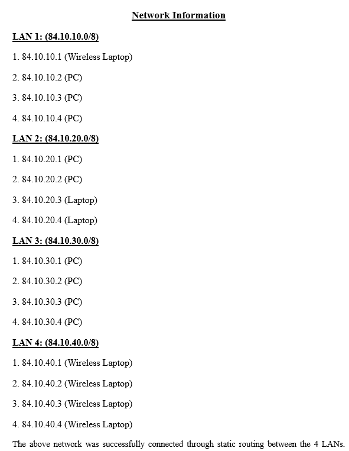
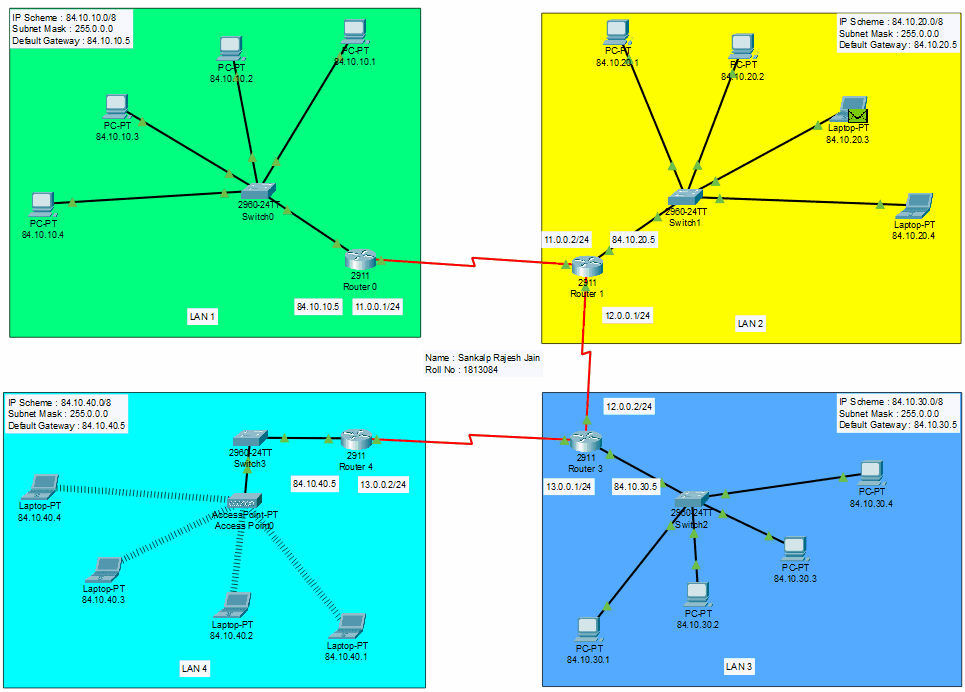
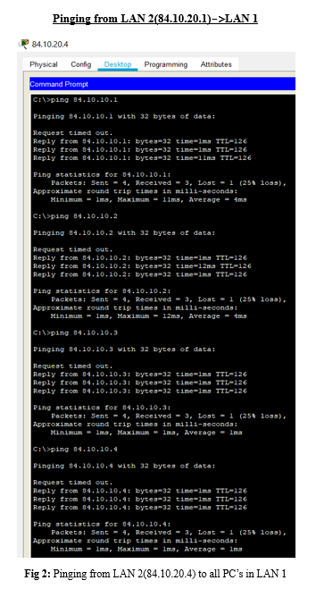
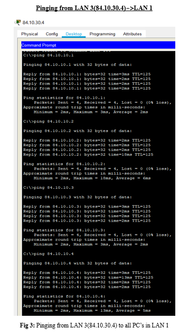
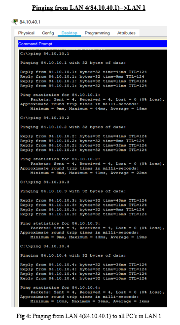

### A project involving implementation of basic concepts of CCN using CISCO PACKET TRACER

<b>Aim :</b>

 
   1. To construct and simulate a Network consisting of 4 different LANs using routers and switches. 
   2. To connect the LANS using static routing. 
   3. Each LAN have a 4 end devices (PCs/Laptops).

<b>Layers of OSI Model :</b>

 
OSI stands for Open Systems Interconnection. It has been developed by ISO – ‘International Organization of Standardization‘, in the year 1984. It is a 7 layer architecture with each layer having specific functionality to perform. All these 7 layers work collaboratively to transmit the data from one person to another across the globe.
 
 
</img> 

<b>Components of CCN used in this project :</b>

 

**1. Computers/ Wireless Laptops :** It is a layer 7 (Application layer) device. End Nodes (End Devices).

**2. Ethernet straight-through cable/Ethernet crossover cable :** It is a layer 1 (Physical Layer) device. Wired Media.

**3. Switch :** It is a layer 2 (Data Link Layer) device. Device for setting up the lan.

**4. Router :** It is a layer 3 (Network Layer) device. A router is a networking device that forwards data packets between computer networks.

**5. Access Point :** It is a layer 2 (Data Link Layer) device. A wireless access point, or more generally just access point, is a networking hardware device that allows other Wi-Fi devices to connect to a wired network.

<b>Network Topology :</b>

 
</img> 
 

<b>Network Information :</b>

 
</img> 
 

<b>Simulation Of Project :</b>

    
   Simulation of <b>pinging</b> from <b>LAN 2(84.10.20.3)</b> to <b>LAN1 PC (84.10.10.3)</b> using <b>static routing</b>.
    
    
    </img>  
 

<b>Working Snippets :</b>

 
</img> 
</img> 
</img> 

  
  

